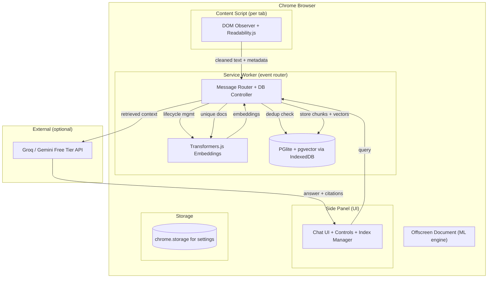

# Second Brain — Personal RAG Chrome Extension

Build a privacy-first, fully local RAG system as a Chrome MV3 extension that indexes your browsing history and answers natural-language questions with citations.

## User Review Required

> [!IMPORTANT]
> **LLM Choice:** The plan defaults to **Groq free tier** (Llama 3.1 8B, 30 RPM / 14,400 RPD) for answer generation. Alternative: Gemini free tier. Local Ollama is possible but requires the user to run a server. **Which do you prefer?**

> [!IMPORTANT]
> **History Backfill:** To address the 2-week corpus requirement within our 5-day timeline, the plan includes a "backfill" feature that re-crawls URLs from your Chrome history. You must **disclose this in FINDINGS.md** as per the brief's rules. Is this acceptable to you?

> [!WARNING]
> **Embedding Model:** Your research recommends `Xenova/all-MiniLM-L6-v2` (384-dim, ~30MB). This is proven and fast via WASM. An alternative is `nomic-embed-text` via Ollama (768-dim, better quality but requires Ollama running). **Recommend sticking with MiniLM for zero-dependency simplicity.**

## Open Questions

1. **Do you have Ollama installed?** If yes, we can use it for embeddings + LLM (fully offline). If no, we'll use Transformers.js + Groq/Gemini.
2. **Do you have a Groq or Gemini API key?** Both are free, but we need to set one up if not.
3. **React or Vanilla JS for the Side Panel UI?** WXT supports both. React is faster to build rich UIs; Vanilla keeps the bundle small.

---

## Architecture Overview



### Runtime Separation (from your research)

| Runtime | Role | Persistence | APIs Available |
|---------|------|-------------|----------------|
| **Content Script** | DOM harvester — observes pages, extracts content via Readability.js, handles SPA navigation | Injected per-tab | DOM, MutationObserver, `document.cloneNode()` |
| **Service Worker** | Event router + control plane — receives captures, runs SimHash dedup, manages PGlite, routes messages | Ephemeral (30s idle timeout) | `chrome.webNavigation`, `chrome.tabs`, `chrome.storage`, message passing |
| **Offscreen Document** | ML inference engine — loads Transformers.js, computes embeddings, holds model weights in memory | Persistent while processing | WASM, WebGPU, full DOM for tensor ops |
| **Side Panel** | User interface — chat, index browser, controls, settings | Persistent while open | Full DOM, `chrome.runtime` messaging |

---

## Proposed Changes

### Build System & Project Scaffold

#### [NEW] Project root — WXT + Vite + TypeScript

We use **WXT** (Web Extension Toolbox) as the framework — it handles MV3 manifest generation, Vite bundling, HMR dev server, and multi-entrypoint builds automatically.

```
second-brain/
├── wxt.config.ts                 # WXT + Vite config with asset copy plugin
├── package.json
├── tsconfig.json
│
├── entrypoints/
│   ├── background.ts             # Service Worker — event router + PGlite
│   ├── content.ts                # Content Script — DOM capture + Readability
│   ├── offscreen.html            # Offscreen Document shell
│   ├── offscreen.ts              # Offscreen Document — Transformers.js engine
│   ├── sidepanel/
│   │   ├── index.html            # Side Panel entry
│   │   ├── App.tsx               # Main chat + controls UI (React)
│   │   ├── components/
│   │   │   ├── ChatView.tsx      # Question/answer chat interface
│   │   │   ├── IndexBrowser.tsx  # Browse/search indexed pages
│   │   │   ├── Controls.tsx      # Pause, exclude, wipe controls
│   │   │   └── SettingsPanel.tsx # Blocklist/allowlist management
│   │   └── styles/
│   │       └── sidepanel.css     # Side panel styles
│   └── popup/
│       ├── index.html            # Minimal popup (status + open side panel)
│       └── Popup.tsx
│
├── lib/
│   ├── capture/
│   │   ├── readability.ts        # Readability.js wrapper + DOM clone
│   │   ├── spa-detector.ts       # SPA navigation detection + MutationObserver
│   │   └── url-cleaner.ts        # Strip tracking params (UTM, fbclid, etc.)
│   ├── dedup/
│   │   ├── simhash.ts            # 64-bit SimHash implementation
│   │   └── hamming.ts            # Hamming distance via BigInt
│   ├── embedding/
│   │   ├── chunker.ts            # Text chunking (512 tokens, 50 overlap)
│   │   └── pipeline.ts           # Transformers.js pipeline init + embedding
│   ├── storage/
│   │   ├── pglite-db.ts          # PGlite init + schema + CRUD operations
│   │   └── settings.ts           # chrome.storage wrapper for user prefs
│   ├── retrieval/
│   │   ├── search.ts             # Vector search + temporal decay re-ranking
│   │   ├── mmr.ts                # Maximal Marginal Relevance diversification
│   │   └── negative-detect.ts    # Confidence threshold for "not in history"
│   ├── generation/
│   │   ├── llm-client.ts         # Groq/Gemini API client (switchable)
│   │   └── prompt-templates.ts   # System prompt + citation formatting
│   ├── privacy/
│   │   ├── blocklist.ts          # Default + custom domain blocklist
│   │   └── net-rules.ts          # declarativeNetRequest rules (block outbound)
│   └── backfill/
│       └── history-crawler.ts    # Chrome history API → re-crawl URLs
│
├── eval/
│   ├── questions.json            # 30 hand-crafted eval questions
│   ├── run-eval.ts               # Automated eval runner script
│   └── logs/                     # Per-question retrieval + answer logs
│
├── public/
│   ├── icons/                    # Extension icons (16, 32, 48, 128)
│   └── transformers/             # ONNX runtime WASM binaries (copied at build)
│
├── FINDINGS.md                   # Results + error analysis + improvements
├── README.md                     # Install, eval run, privacy model
└── .gitignore
```

---

### Data Capture Pipeline

#### [NEW] [content.ts](file:///d:/Internship%20Assignments/second-brain/entrypoints/content.ts) — Content Script

The DOM harvester, injected into every allowed page:

1. **SPA Detection** — Listen for `chrome.webNavigation.onHistoryStateUpdated` signals from Service Worker. Also watch for `popstate` events and `MutationObserver` on `document.body` with **500ms debounce** to wait for SPA DOM settlement.

2. **Readability Extraction** — On settled DOM:
   - Call `isProbablyReaderable()` preflight → abort if page is a dashboard/app
   - Deep-clone DOM via `document.cloneNode(true)` (never mutate the live page)
   - Run `new Readability(clonedDoc).parse()` → extract `{ title, textContent, byline, excerpt }`
   - Filter: reject if `textContent.length < 200` characters (too thin to be useful)

3. **URL Cleaning** — Strip tracking parameters (UTM, fbclid, gclid, ref, etc.) to normalize URLs

4. **Message to Service Worker** — Send `{ type: 'PAGE_CAPTURED', payload: { url, title, textContent, capturedAt, byline } }`

#### [NEW] [spa-detector.ts](file:///d:/Internship%20Assignments/second-brain/lib/capture/spa-detector.ts) — SPA Navigation Handler

```typescript
// Core logic: debounced MutationObserver
function waitForDOMSettle(callback: () => void, timeoutMs = 500): void {
  let timer: number;
  const observer = new MutationObserver(() => {
    clearTimeout(timer);
    timer = setTimeout(() => {
      observer.disconnect();
      callback();
    }, timeoutMs);
  });
  observer.observe(document.body, { childList: true, subtree: true });
  // Fallback timeout in case no mutations happen
  timer = setTimeout(() => {
    observer.disconnect();
    callback();
  }, timeoutMs);
}
```

---

### Deduplication Engine

#### [NEW] [simhash.ts](file:///d:/Internship%20Assignments/second-brain/lib/dedup/simhash.ts) — 64-bit SimHash

Custom implementation (no npm dependency — existing packages are ancient):

1. **Tokenize** text into 3-word shingles
2. **Hash** each shingle with FNV-1a (fast, non-cryptographic, browser-native)
3. **Compute** 64-bit SimHash fingerprint using the weighted vector accumulation algorithm (from your research)
4. **Store** as two 32-bit integers or BigInt

#### [NEW] [hamming.ts](file:///d:/Internship%20Assignments/second-brain/lib/dedup/hamming.ts) — Hamming Distance

```typescript
function hammingDistance(a: bigint, b: bigint): number {
  let xor = a ^ b;
  let count = 0;
  while (xor > 0n) {
    count += Number(xor & 1n);
    xor >>= 1n;
  }
  return count;
}
```

**Dedup thresholds** (from your research):

| Hamming Distance | Action |
|-----------------|--------|
| 0–3 bits (>95% similar) | **Discard** — update `lastVisited` timestamp only |
| 4–10 bits (84–94%) | **Flag** — store but collapse during retrieval |
| >10 bits (<84%) | **Index** — new unique content, run full embedding pipeline |

---

### Embedding Pipeline

#### [NEW] [pipeline.ts](file:///d:/Internship%20Assignments/second-brain/lib/embedding/pipeline.ts) — Offscreen Document Inference

- Model: **`Xenova/all-MiniLM-L6-v2`** (384-dim, ~30MB, ONNX format)
- Runtime: **Transformers.js v3** with WASM backend (WebGPU if available)
- The Offscreen Document holds the model in memory persistently

**CSP Fix** (critical, from your research):
1. Vite build plugin copies ONNX runtime `.wasm` + `.mjs` files from `node_modules` → `dist/transformers/`
2. `manifest.json` declares `web_accessible_resources: ["transformers/*"]`
3. Before pipeline init: `env.backends.onnx.wasm.wasmPaths = chrome.runtime.getURL('transformers/')`
4. Manifest CSP includes `"wasm-unsafe-eval"` directive

#### [NEW] [chunker.ts](file:///d:/Internship%20Assignments/second-brain/lib/embedding/chunker.ts) — Text Chunking

- **512 tokens** per chunk, **50 token overlap** (sliding window)
- Sentence-boundary-aware splitting (don't cut mid-sentence)
- Each chunk carries metadata: `{ sourceUrl, title, chunkIndex, capturedAt }`

---

### Vector Storage

#### [NEW] [pglite-db.ts](file:///d:/Internship%20Assignments/second-brain/lib/storage/pglite-db.ts) — PGlite + pgvector

```sql
-- Schema (from your research, enhanced)
CREATE EXTENSION IF NOT EXISTS vector;

CREATE TABLE IF NOT EXISTS documents (
    doc_id BIGSERIAL PRIMARY KEY,
    url TEXT NOT NULL,
    title TEXT,
    text_content TEXT NOT NULL,
    simhash_hi INTEGER NOT NULL,      -- SimHash upper 32 bits
    simhash_lo INTEGER NOT NULL,      -- SimHash lower 32 bits
    captured_at TIMESTAMPTZ DEFAULT NOW(),
    last_visited TIMESTAMPTZ DEFAULT NOW(),
    is_backfill BOOLEAN DEFAULT FALSE  -- Flag for history backfill
);

CREATE TABLE IF NOT EXISTS chunks (
    chunk_id BIGSERIAL PRIMARY KEY,
    doc_id BIGINT REFERENCES documents(doc_id) ON DELETE CASCADE,
    chunk_index INTEGER NOT NULL,
    chunk_text TEXT NOT NULL,
    embedding VECTOR(384),
    source_url TEXT NOT NULL,
    document_title TEXT,
    captured_at TIMESTAMPTZ NOT NULL
);

CREATE INDEX IF NOT EXISTS idx_chunks_embedding 
    ON chunks USING hnsw (embedding vector_cosine_ops);

CREATE TABLE IF NOT EXISTS dedup_flags (
    doc_id BIGINT PRIMARY KEY REFERENCES documents(doc_id),
    collapse_with BIGINT REFERENCES documents(doc_id)
);
```

**Persistence:** `new PGlite({ dataDir: 'idb://second-brain-db', extensions: { vector } })`

---

### Retrieval System

#### [NEW] [search.ts](file:///d:/Internship%20Assignments/second-brain/lib/retrieval/search.ts) — Hybrid Search + Temporal Decay

**Step 1: Vector Search** — Embed query → cosine similarity search → top-K candidates (K=20)

**Step 2: Temporal Decay Re-ranking** (from your research):
```
final_score = cosine_similarity × exp(-λ × Δt)
```
Where `λ = ln(2) / (7 × 24 × 3600)` gives a 7-day half-life. Documents read recently score higher when semantic similarity is comparable.

**Step 3: Time-Scoped Filtering** — If query contains temporal markers ("last week", "yesterday", "this month"), apply hard date-range SQL `WHERE` clause before vector search.

**Step 4: MMR Diversification** — From top-20, select top-5 using Maximal Marginal Relevance (λ_mmr=0.5) to avoid returning 5 chunks from the same page.

**Step 5: Dedup Collapse** — If any returned chunks belong to documents flagged as `collapse_with`, keep only the most recent variant.

#### [NEW] [negative-detect.ts](file:///d:/Internship%20Assignments/second-brain/lib/retrieval/negative-detect.ts) — Negative Rejection

If the **highest cosine similarity** in the top-K results is below a threshold (e.g., 0.35), the system returns `"Not in your history"` instead of passing low-quality context to the LLM.

---

### LLM Generation

#### [NEW] [llm-client.ts](file:///d:/Internship%20Assignments/second-brain/lib/generation/llm-client.ts) — Groq/Gemini Client

Switchable client supporting:
- **Groq** (default): `llama-3.1-8b-instant` — 30 RPM, 14,400 RPD free
- **Gemini** (fallback): `gemini-2.0-flash` — generous free tier
- **Ollama** (local): Any model the user has pulled

#### [NEW] [prompt-templates.ts](file:///d:/Internship%20Assignments/second-brain/lib/generation/prompt-templates.ts)

```
SYSTEM: You are a personal browsing history assistant. Answer questions 
ONLY using the provided context chunks from the user's browsing history. 
Each chunk includes [SOURCE_URL] and [CAPTURED_DATE] metadata.

Rules:
1. If the context does not contain the answer, respond EXACTLY: 
   "Not in your history."
2. NEVER use your training knowledge. Only cite what's in the chunks.
3. End your answer with numbered citations: [1] URL — "relevant quote"
4. For time-scoped questions, prefer chunks matching the time range.

CONTEXT:
[1] Source: {url} | Read: {date}
{chunk_text}

[2] Source: {url} | Read: {date}  
{chunk_text}
...

USER QUESTION: {query}
```

---

### Privacy & Controls

#### [NEW] [blocklist.ts](file:///d:/Internship%20Assignments/second-brain/lib/privacy/blocklist.ts)

**Default blocklist** (never capture):
- Banking: `*.bank.*`, `*banking*`, `*paypal*`, `*venmo*`
- Email: `mail.google.com`, `outlook.live.com`, `*.mail.*`
- Health: `*health*`, `*patient*`, `*medical*`
- Auth: URLs containing `login`, `signin`, `password`, `oauth`, `checkout`
- Social DMs: `*messages*`, `*inbox*`

**User controls** (via Side Panel):
- ⏸️ Pause/Resume capture globally
- 🚫 Add/remove domains from blocklist
- 🗑️ Delete individual indexed pages
- 💣 Wipe entire database
- 📊 View index stats (pages indexed, total chunks, storage used)

#### [NEW] [net-rules.ts](file:///d:/Internship%20Assignments/second-brain/lib/privacy/net-rules.ts)

Use `chrome.declarativeNetRequest` to block ALL outbound requests from the extension context except:
- Hugging Face CDN (one-time model download)
- Groq/Gemini API (for generation only)

---

### History Backfill

#### [NEW] [history-crawler.ts](file:///d:/Internship%20Assignments/second-brain/lib/backfill/history-crawler.ts)

To build corpus from past browsing:

1. Use `chrome.history.search({ text: '', maxResults: 500, startTime: twoWeeksAgo })` to get recently visited URLs
2. Filter out blocklisted domains
3. For each URL, open in a background tab via `chrome.tabs.create({ active: false })`
4. Content script captures + extracts as normal
5. Mark documents with `is_backfill = true` in the database
6. **Disclose in FINDINGS.md** that backfill was used

> [!WARNING]
> Backfilled pages may have changed content since original visit. Capture timestamps will reflect re-crawl time, not original reading time. We'll use `chrome.history` visit timestamps for `captured_at` to partially address this, but time-scoped eval questions may be less reliable for backfilled data.

---

### Side Panel UI

#### [NEW] Side Panel — React-based chat interface

Three tabs in the Side Panel:

1. **Ask** — Chat interface
   - Text input with send button
   - Streaming answer display with markdown rendering
   - Clickable citation links that open the source page
   - "Not in your history" displayed clearly for negative cases

2. **Index** — Browse captured pages
   - Searchable list of all indexed documents
   - Shows: title, URL, captured date, chunk count
   - Click to re-open page; swipe to delete

3. **Settings** — Privacy controls
   - Pause/Resume toggle
   - Blocklist management
   - Backfill trigger button
   - Wipe database button (with confirmation)
   - LLM provider selector (Groq/Gemini/Ollama)
   - Index statistics

---

### Evaluation Framework

#### [NEW] [questions.json](file:///d:/Internship%20Assignments/second-brain/eval/questions.json)

30 questions across 4 topologies (from your research):

| Topology | Count | Example |
|----------|-------|---------|
| **Direct Fact Extraction** | 10 | "What is the maximum context length of Llama 3?" |
| **Multi-Hop Synthesis** | 8 | "How does article A's approach compare to article B's?" |
| **Time-Scoped Retrieval** | 7 | "What did I read about React last week?" |
| **Negative Cases** | 5 | "What are the specs of the iPhone 20?" (never read) |

Each entry:
```json
{
  "id": 1,
  "question": "...",
  "topology": "direct|multi_hop|time_scoped|negative",
  "ground_truth_answer": "...",
  "source_urls": ["..."],
  "source_quotes": ["exact passage from the page"],
  "expected_behavior": "correct|not_in_history"
}
```

#### [NEW] [run-eval.ts](file:///d:/Internship%20Assignments/second-brain/eval/run-eval.ts)

Automated eval script that:
1. Loads `questions.json`
2. Runs each query through the retrieval + generation pipeline
3. Logs: retrieved chunks, cosine scores, generated answer
4. Scores: `correct | partial | wrong | hallucinated`
5. Outputs per-question logs to `eval/logs/`
6. Generates summary metrics: Context Precision, Context Recall, Faithfulness

---

### FINDINGS.md Structure

```markdown
# FINDINGS.md

## Results Table
| Topology | Total | Correct | Partial | Wrong | Hallucinated |
|----------|-------|---------|---------|-------|--------------|

## Error Analysis (5 Most Interesting Failures)
For each: the question, retrieved chunks (quoted), what went wrong, root cause

## The One Improvement: Before/After
Component improved, what changed, measured lift in metrics

## One Surprise
Something unexpected discovered during fieldwork

## Privacy/Threat Model
Architecture diagram, what's blocked, what can't leak, honest limitations

## AI Usage Note
Full disclosure of all AI tools used in the build
```

---

## 5-Day Execution Timeline

| Day | Focus | Deliverables |
|-----|-------|-------------|
| **Day 1 (Wed)** | Project scaffold + capture pipeline | WXT project, content script, Readability extraction, SPA detection, URL cleaning, blocklist |
| **Day 2 (Thu)** | Dedup + embedding + storage | SimHash, chunker, Transformers.js in offscreen doc, PGlite schema, full indexing pipeline working |
| **Day 3 (Fri)** | Retrieval + generation + UI | Vector search, temporal decay, MMR, LLM client, Side Panel chat UI, controls |
| **Day 4 (Sat AM)** | Backfill + eval + polish | History backfill feature, build 30-question eval, run eval, build index browser UI |
| **Day 5 (Sat PM)** | FINDINGS.md + demo + submit | Error analysis, improvement iteration, record demo video, push to GitHub |

---

## Verification Plan

### Automated Tests
- `npm run eval` — runs the 30-question eval suite, outputs `eval/logs/` and summary metrics
- Manual spot-check of 5 random eval questions against live index

### Manual Verification
- Load extension in Chrome via `chrome://extensions` → Load unpacked
- Browse 10+ diverse sites (news, docs, blogs, social media)
- Verify capture, dedup, and retrieval all function
- Test negative cases ("not in history")
- Test SPA navigation on YouTube, Twitter, GitHub
- Verify blocklist prevents capture of banking/email
- Record 2–3 min demo video showing: ask 3 live questions including 1 negative case

### Live Follow-up Prep
- Practice: predict what the system will retrieve for a fresh question, then run it
- Prepare defense of worst failure and root-cause diagnosis
- Have the index ready for a new question from the evaluator

---

## Tech Stack Summary

| Component | Technology | Cost |
|-----------|-----------|------|
| Framework | WXT + Vite + TypeScript | $0 |
| Content Extraction | Readability.js (@mozilla/readability) | $0 |
| Dedup | Custom SimHash (64-bit, FNV-1a) | $0 |
| Embeddings | Transformers.js + all-MiniLM-L6-v2 (ONNX) | $0 |
| Vector Store | PGlite + pgvector (IndexedDB persistence) | $0 |
| LLM | Groq free tier (Llama 3.1 8B) | $0 |
| UI | React (Side Panel) | $0 |
| **Total** | | **$0** |
